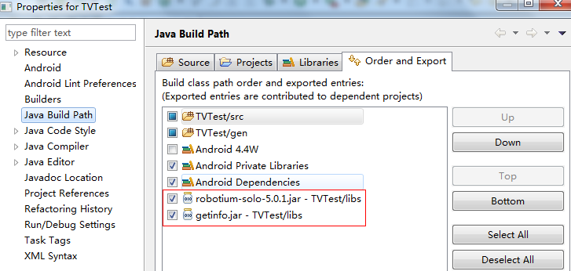
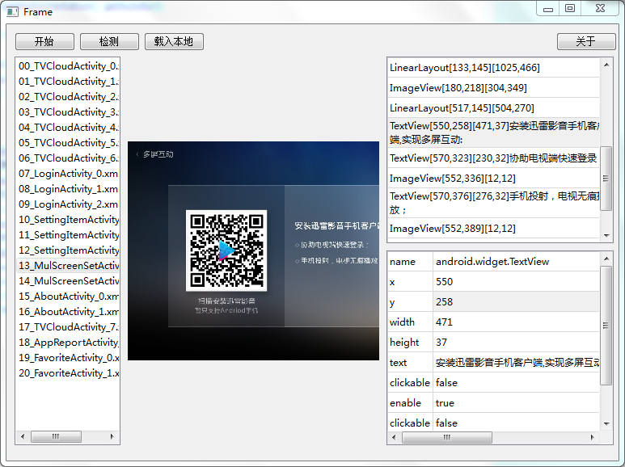

来源和原理来自于这个帖子 [http://testerhome.com/topics/1050](http://testerhome.com/topics/1050 "来源和原理")

### 工具的原理

1. 在手机端调用robotium框架获取当前界面的所有View，存入本地xml文件
2. PC运行界面程序，用adb拉取xml文件并分析，然后界面展示出来

### 目前存在的不足

1. 界面各种细节需要调整 （重构界面）
2. 获取的界面信息实际是一个list，很不利于查找 (获取成tree，同时展示成tree)
3. 只展示了截图，当点击具体一个view时，没有在截图上标明 (选择一个特定的view时，在截图上绘图)
4. 需要导入Robotium包，操作略麻烦 (直接对Instrumentation封装)
5. 界面程序是python写的，但是环境问题一直没有打包exe成功

### 优点

1. 不需要root
2. 开发如果使用的自定义的组件，可以显示出组件名（在uiautomatorviewer里边只会显示基类的类名，hierarchyviewer未尝试）
3. 几乎100%可以识别出id
4. 支持将界面信息存储在PC本地，并且离线直接读取本地文件
5. 手机端提供三个调用入口，方便实现通过脚本自动获取所有所需界面的信息

### 使用方法

1. 新建一个Android测试工程，填好各项配置
2. 导入robotium框架和getinfo.jar

#### robotium地址
[http://www.robotium.cn/download](http://www.robotium.cn/download "robotium地址")

**请保证该处打钩：**



**getInfo.jar提供三个方法，在测试脚本中使用其中一个**

```java
GetCurrentInfo gci = new GetCurrentInfo(solo);
//每隔5s获取一次界面元素
gci.loopGetInfo();
//每隔time毫秒获取一次界面元素
gci.loopGetInfo(int time);
//获取一次界面元素（loop暂时无用，可以随便赋值）
gci.getCurrentInfo(boolean loop);
```

**以gci.loopGetInfo();为例：建立一个普通的测试任务，新建一个测试方法：**

```java
public class GetInfoTest extends ActivityInstrumentationTestCase2 {
    private static final String LAUNCHER_ACTIVITY_FULL_CLASSNAME = "yourTestAppPackageName";
    private Solo solo;
    public GetInfoTest() throws ClassNotFoundException {
        super(Class.forName(LAUNCHER_ACTIVITY_FULL_CLASSNAME));
    }
    protected void setUp() throws Exception {
        solo = new Solo(getInstrumentation(), getActivity());
    }
    public void tearDown() throws Exception {...}

    public void testGetInfo() {     
        GetCurrentInfo gci = new GetCurrentInfo(solo);
        gci.loopGetInfo();
    }
}
```

**执行该方法，因为loopGetInfo()中使用了while(true)循环，所有不手动中止测试，会一直运行（最简便的是直接退出被测应用）
你需要做的是，在每个你需要的界面停留至少5s**

### Windows用户和Mac用户直接运行

在项目的bin目录下有打包完成的可执行程序文件
支持windows和mac

### linux用户

安装pyqt环境

```bash
python getinfoviewer.py
```

### 使用
按‘检测’按钮可以检测设备情况



### 载入本地信息


ps:如果在测试脚本中使用

```java
gci.getCurrentInfo(boolean loop)
```

并增加脚本，每次新的测试包都可以跑一遍，然后使用文本比对工具查看是否有更改的UI

这个工具，可能实际并不实用，但是已经基本实现当时所想，也因为这个想法，督促自己学了Python和PyQt，相当于是一个练习之作吧。
半成品作品，等以后工作稳定下来并且闲一点，再更新吧。
有任何建议，bug，请告诉我
